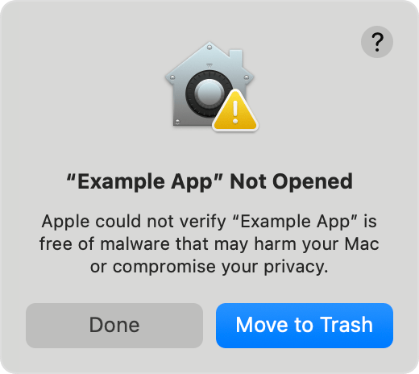
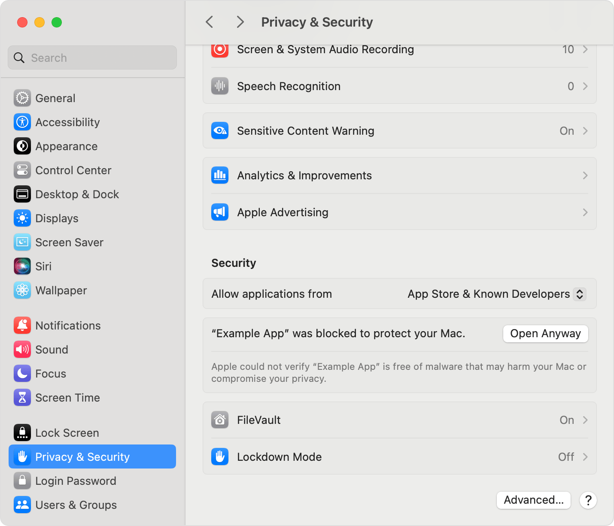

# PetroSeg: Unsupervised Segmentation App Using Deep Learning
Forked from: https://github.com/fazzam12345/PetroSEG-v2

------------

## Table of Contents
1. Introduction
2. Acknowledgments
3. Requirements
4. Installation
5. How to Run
6. Contributing
7. License


## Introduction
This project is an unsupervised image segmentation application originally built as a Streamlit web app. It has now been extended and packaged into a standalone desktop application for easier use. The core functionality remains the same: the app performs unsupervised segmentation on uploaded images, allowing users to adjust segment colors and download the segmented output. By consolidating the codebase into a single module and updating dependencies, this version improves compatibility and performance (including hardware acceleration on Apple Silicon Macs) while preserving all features of the original application.

## New in this version (fork):
- Standalone App Packaging: The project is now packaged as a desktop application, so users (especially on macOS) can run it without installing Python or libraries. This provides a one-click experience with an integrated GUI, removing the need to use a web browser or command-line interface.
- Consolidated Codebase: All source code has been merged into one file to simplify the build and deployment process. This makes it easier to maintain and create builds for different platforms.
- Updated Libraries with Hardware Acceleration: The application’s deep learning backend has been updated to the latest libraries. In the latest version, the segmentation algorithm leverages TensorFlow (migrated from PyTorch in the original) with support for Apple’s ML Compute/Metal acceleration on M1/M2 devices. This means improved performance on macOS. (Future releases will similarly leverage NVIDIA CUDA on Windows and NVIDIA/AMD GPU acceleration on Linux via CUDA/ROCM.)
- Cross-Platform Plans: While the current release focuses on macOS (Apple arm64), builds for Linux (with CUDA and ROCm support) and Windows (with CUDA support) are planned. The goal is to provide optimized executables for each platform without requiring users to manually set up environments.

This application remains user-friendly for petrographic image analysis and thin section images. It still allows you to upload an image, automatically segment the image using unsupervised deep learning, customize the colors of each segment, and then download the result. Researchers and professionals can continue to use this tool for microscopy analysis with the confidence that the underlying segmentation algorithm is unchanged from the original PetroSeg project (ensuring consistent results), now delivered in a more accessible format.

------------

## Acknowledgments

This code is inspired by the project pytorch-unsupervised-segmentation by Kanezaki. The original project is based on the paper “Unsupervised Image Segmentation by Backpropagation,” presented at IEEE ICASSP 2018. The code has been further optimized for thin section images and microscopy analysis in the context of petrographic segmentation.

------------

## Requirements

### For running the application from source (or developing further), you will need the following:
- Python 3.7+ – (Python 3.7 or later is required. The application has been tested on newer Python versions as well.)
- TensorFlow – Deep learning library used for the segmentation algorithm (with support for GPU acceleration, e.g. Apple Metal on macOS).
- OpenCV – Library for image processing operations.
- NumPy – Fundamental package for numerical computations.
- scikit-image – Image processing library (used for image segmentation utilities).
- PIL/Pillow – Python Imaging Library for image I/O and manipulations.
- base64 – (Used for encoding images for download or embedding within the app interface.)

Note: If you use the pre-built macOS application, all required libraries are already bundled – you do not need to install anything separately. The above requirements are only relevant if you are running the app from source or doing development.

------------

# Installation

## Option 1: Use the Pre-Built macOS App (Apple Silicon)

If you are on macOS, you can simply download the pre-built PetroSeg application from the Releases section of this repository. The app comes as a .app bundle (for Apple M-Series devices):
1.	Download the latest PetroSeg.app from the Releases page.
2.	Run the application by double-clicking the PetroSeg.app. (On first run, you may need to right-click and select “Open” due to macOS security settings, since the app is not signed.)
3.	Start segmenting! The application will launch a window with the PetroSeg interface, where you can load images and perform segmentation without any manual setup.

No Python or manual installation of dependencies is required for the macOS app. All necessary libraries (including those optimized for Apple Silicon) are packaged within the application.

## Option 2: Run from Source (Windows/Linux/macOS)

For users on other platforms or those who wish to run the latest code from source, follow these steps:
1.	Clone the repository (this fork of PetroSEG):
```bash
git clone https://github.com/fazzam12345/PetroSEG-v2
```

2.	Navigate to the project directory:
```bash
cd PetroSEG-v2
```

3.	Install the required packages listed in requirements.txt:
```bash
pip install -r ./requirements.txt
```
Ensure you have a compatible version of Python and the ability to install the deep learning frameworks (e.g., TensorFlow). On Apple Silicon Macs, the requirements file may point to specific package versions that include Metal acceleration.

4.	Launch the application:
```bash
streamlit run app.py
```
This will start the PetroSeg application. If you are on Windows or Linux, the app will run using the same code (utilizing CPU or CUDA/ROCM if available for acceleration). On macOS, it will use the Apple-optimized backend for speed. Once running, you should see the interface where you can upload an image, run segmentation, and visualize results.

------------

## How to Run
- Using the macOS App: After downloading the .app bundle (see Installation above), simply double-click it to run.  For the first run:
If you download an app like PetroSeg from outside the App Store, macOS will block it by default. Follow these steps to open the app on an Apple Silicon Mac running macOS.

### Step 1: Attempt to Open the App

When you first double-click PetroSeg.app, macOS Gatekeeper will prevent it from launching. You’ll see a warning dialog such as: "PetroSeg can’t be opened because it is from an unidentified developer." The only options will be to Move to Trash or Cancel/Done – no "Open" button. This is normal; it means the app isn’t notarized or signed by a registered Apple developer, so macOS cannot verify its safety.  For now the app is not, but in the future it will be.



### Step 2: Allow the App in System Settings

Next, open System Settings and go to Privacy & Security. Scroll down to the Security section. You should see a message at the bottom saying that “PetroSeg was blocked from use because it is not from an identified developer,” along with an Open Anyway button . Click Open Anyway to manually override Gatekeeper for this app . (This option appears only for about an hour after a failed app launch.) By clicking Open Anyway, you’re telling macOS that you trust the app and want to run it despite the warning.



### Step 3: Re-open the App and Confirm

Now go back and open PetroSeg.app again (double-click it in Finder). This time, you’ll get a confirmation prompt asking if you’re sure you want to open the app. The dialog will note that macOS “cannot verify the developer” and may warn about potential malware, but it will now include an Open button . Click Open to confirm and launch the app. After this, macOS will remember your choice – PetroSeg is saved as an exception to your security settings, so you won’t see the warning again for this app .

------------

Regardless of the method, the user experience and features are the same. The application provides an interactive UI to perform unsupervised segmentation on your images:
1.	Upload Image – Choose the petrographic image or thin section photo you want to segment.
2.	Run Segmentation – The app will apply the unsupervised deep learning algorithm to partition the image into segments (no prior training or labels needed).
3.	Adjust Colors (Optional) – You can cycle through or pick new colors for each segmented region to improve visual distinction or match your preferences.
4.	Download Result – Once satisfied, save the segmented image. In the web/streamlit interface this is done via a download link, and in the desktop app you can directly save the file to your system.


Above: Screenshot of the PetroSeg application interface in action, showing an example segmentation output. (The interface allows easy image upload, segmentation, color tuning, and result download.)

⸻

Contributing

Feel free to open issues and pull requests! Contributions to improve the application or extend its cross-platform support are welcome. If you have ideas for new features, enhancements to the segmentation algorithm, or improvements to the build process (for example, helping with Windows/Linux packaging and GPU support), please contribute or contact the maintainers.

⸻

License

This project is licensed under the MIT License. By contributing or using this software, you agree to the terms of the MIT License (see the LICENSE file for details).